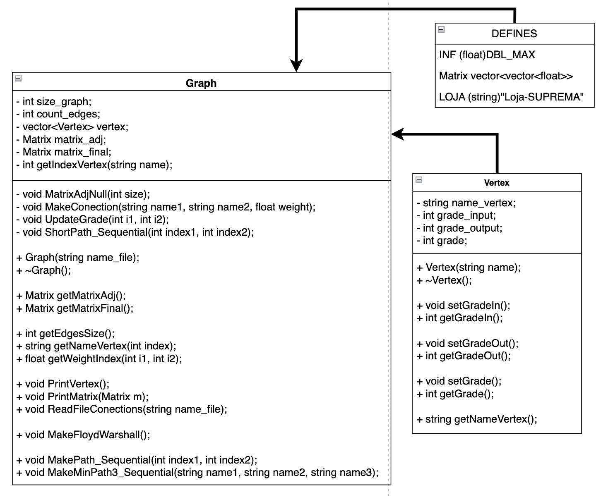
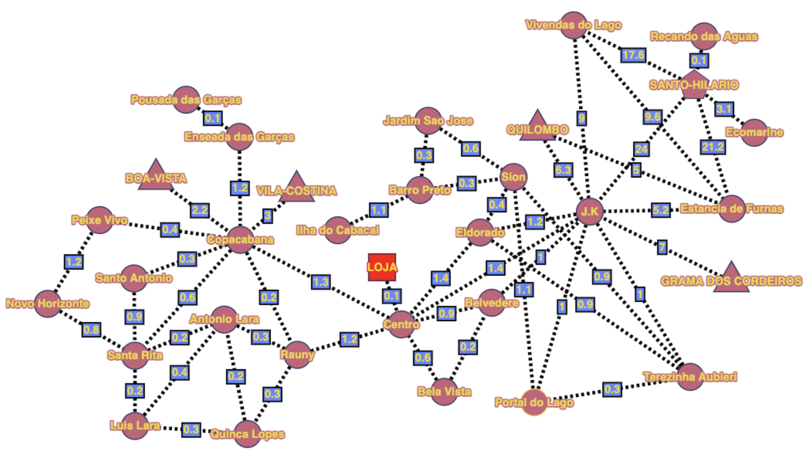
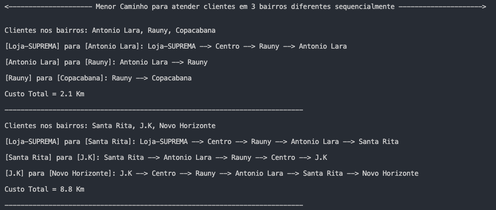

<div align="justify">

<div align="center">

# Problema do Caminho Mínimo
## Para Entregas Sequenciais em Bairros Distintos de Pimenta-MG 

<br>
Figura 1 - Vista Aérea da cidade de Pimenta-MG.


</div>

## 1 - Introdução

A cidade de **Pimenta**, localizada no estado de **Minas Gerais**, à 240Km da capital **Belo Horizonte**. Possui ao todo 24 bairros e 1 Distrito - isso, de acordo com a Prefeitura Municipal. Contudo, para uma mapeamento melhor das cidade e para fidelidade do problema, foram introduzidas 4 Zonas Rurais que não são documentadas como logradouros pela prefeitura, mas possuem sua importância devido a quantidade substancial de habitantes em cada uma delas.

Os bairros são: *Antonio Lara, Barro Preto, Bela Vista, Belvedere, Centro, Copacabana, Eldorado, Enseada das Garças, Estancia de Furnas, Ilha do Cabaçal, J.K, Jardim Sao Jose, Luis Lara, Novo Horizonte, Peixe Vivo, Portal do Lago, Pousada das Garças, Quinca Lopes, Rauny, Santa Rita, Santo Antonio, Sion, Terezinha Aubieri e Vivendas do Lago*. Contando ainda com o distrito de *Santo-Hilário*, que possui dois bairros, *Recanto das Águas e Ecomarine*. Além disso, não podendo esquecer das 4 zonas rurais, que são: B*oa-Vista, Grama-dos-Cordeiros, Quilombo e Vila-Costina*.

> De acordo com o **IBGE** de 2021, a população estimada de Pimenta é de 8715 habitantes. Mas, conforme com algumas estimativas da Prefeitura, esse número pode ser maior em até 380 habitantes.

## 2 - O problema

Devido a expansão do agronegócio, a cidade está em constante crescimento. Consequentemente, também houve uma expansão no ramo da construção cívil. Tanto na área industrial/agrícola, quanto na área doméstica. Com isso a loja de materiais de construção, "SUPREMA", localizada na *rua Olinto Fonseca, nº544*, recentemente começou a enfretar um problema para atender seus clientes de maneira rápida e eficiente. 

O caminhão "toco", como é popularmente chamado, devido ao fato de a sua "caçamba" ter abertura para todos os lados, consegue carregar 13,5 toneladas de material. Este caminhão é muito utilizado quando é necessário transportar mais de um material, seja ele um material bruto - como brita, areia, terra e etc - ou não - como sacos de cimento, argamassa, tijolos e etc. O problema da empresa começa quando é preciso atender 3 clientes ou mais, que estão situados em bairros diferentes e necessitam de materiais distintos.

### 2.1 - O problema na prática

Suponhamos 3 clientes: A, B e C. Todos os três, moram em bairros diferentes e cada um comprou sos seguintes materiais: 

| Clientes   |  Materiais                                    |  Bairros
| -----------| ----------------------------------------------|---------------
|A           | 12 sacos de Cimento e 10 sacos de cal         |  Antonio Lara
|B           | 14 telhas de fibrocimento (2,44 x 1,10)       |  J.K
|C           | 1m $^{3}$ de Areia grossa                      |  Barro Preto

Ao passar este pedido para os funcionários que irão carregar o caminhão com os materiais. Os mesmo, irão fazer o seu trabalho da melhor forma possível, com o intuito de facilitar o descarregamento nos endereços dos clientes. Dessa forma, ao carregarem o caminhão, os mesmos funcionários irão passar a ordem com que as entregas deverão ser feitas. Neste caso hipotético, a ordem seria: Primeiro o **cliente B**, pelo fato de as telhas de fibrocimento serem frágeis e compridas, são sempre traspontadas em cima de algum material - neste caso, em cima dos sacos de cimento ou de cal - e amarradas ao caminhão. Logo em seguida será o **cliente A**, visto que, os sacos de cimento pesam 50kg e os sacos de cal, pesam 20Kg e por isso, são carregados bem em frente as aberturas das portas laterais do caminhão - isso facilita também o carregamento. Por fim, o último será o **cliente C**, pelo fato de a areia se esparramar, deve ser carregada primeiro, e deve ser coloca na região central, até a parte traseira da caçamba, para facilitar o descarregamento.

Recapitulando o que foi dito acima, para deixar mais claro o problema, o caminhão será carregado sequencialmente com os materiais dos seguintes clientes na ordem: C $\to$ B $\to$ A. E a entrega será feita na seguinte sequência de clientes na ordem: B $\to$ A $\to$ C. Note que, não necessariamente a ordem de entrega será a ordem inversa da ordem de carregamento dos materiais no caminhão. Dessa forma, temos que encontrar o menor caminho para atender os clientes sequencialmente, saíndo com a nota fiscal da loja e indo para o bairro *J.K* e depois para o bairro *Antonio Lara* e por fim o bairro *Barro Preto*.

> Antes de lidar com o problema do caminho mínimo é preciso lidar com a logística do abastecimento do caminhão com os materiais que deverão ser entregues. Com isso pode-se deixar claro que, as entregas dependem de como o caminhão será carregado e é a ordem de entrega dos materiais que definem a ordem da busca pelo menor caminho no algoritmo.

## 3 - O Algoritmo

Conforme a documentação anterior, presente em [Readme.md](./README.md), foi implementado o algoritmo de Floyd-Warshall conforme a literatura, ou seja, utilizando **Matriz de adjacências**. O código do projeto foi desenvolvido por meio de classes na linguagem C++.

### 3.1 - Diagrama de Classes

Para a criação do grafo orientado, foi utilizado duas classes e para facilitar a legibilidade do código, foi utilizado 3 definições.

<div align="center">

<br>
Figura 2 - Diagrama de classes

</div>

A classe **Vertex** é a estrutura do vértice. No grafo que foi construido, cada vértice  representa um bairro da cidade de Pimenta. Por isso temos o atributo `string name_vertex`. Os demais atributos são referentes aos graus de entrada - quantidade de arestas que chegam a um vértice -, aosgraus de saída - quantidades de arestas que saem de um vértice. O grau de um vértice é dado pela soma dos graus de entrada e de saída. Os métodos desta classe são todos criado para acessar os atributos.

A classe **Graph** é a estrutura do grafo orientado. Nela, temos os atributos responsáveis pelo funcionamento da estrutura, desde as variáveis que guardam a quantidade de vértices e arestas do grafo, até o vetor que contém todos os vértices presentes no grafo. Para representar este grafo e implementar o Floyd-Warshall, temos também como atributos duas matrizes de adjacências, `matrix_adj` - responsável inicialmente, por representar as conexões entre os vértices com seus respectivos pesos - e a `matrix_final` - resposável apenas por ser a matriz de caminhos (predecessores). Com relação aos métodos, temos os "famosos" útilitários - *get's e set's* -, os que fazem o funcionamento da estrutura, como o próprio construtor, e os métodos `MatrixAdjNull(int size)`, `MakeConection(string name1, string name2, float weight)`, `ReadFileConections(string name_file)`,`PrintVertex()` e `PrintMatrix(Matrix m)` . Além destes métodos citados, temos os métodos responsáveis por nos dar os resultados do problema de caminho mínimo, como o próprio procedimento para executar o Floyd-Warshall, `MakeFloydWarshall()` e os procedimentos com a responsabilidade de encontrar o caminho mínimo entre os 3 bairros distintos de forma sequencial, `ShortPath_Sequential(int index1, int index2)`, `MakePath_Sequential(int index1, int index2)` e `MakeMinPath3_Sequential(string name1, string name2, string name3)`. Todos os métodos não explicados aqui neste parágrafo serão compreendidos ao explicar o funcionamento do código.

### 3.2 - Funcionamento

- O código inicialmente faz a leitura do arquivo de vértices **`vertex_inputs.txt`** e armazenando cada vértice no vetor de `vertex`
logo em seguida é contabilizado quantos vértices há no vetor e então faz-se as inicializações das matrizes de adjacências pelo método `MatrixAdjNull(int size)`. Toda esta parte anterior descrita é implementada dentro do contrutor da classe **Graph**.
- Em seguida, é feita a leitura do arquivo de conexões entre os vértices - no caso deste problema, o arquivo contém os bairros e suas conexões ponderadas - **`edges_inputs.txt`**. Por meio da leitura, é possivel encontrar o índice de cada par vértice na matriz `matriz_adj` e então colocar o valor referente ao peso da conexão entre estes dois vértices - estas conexões são feitas pelo método `MakeConection(string name1, string name2, float weight)`. Toda a lógica em volta da leitrua do arquivo esta implementado dentro do procedimento `ReadFileConections(string name_file)`.

Após terem sido feitas todas as conexões do arquivo **`vertex_inputs.txt`**, a `matrix_adj` irá representar o seguinte grafo referente aos bairros da cidade de Pimenta. Conforme a Figura 3 abaixo, cujo os bairros são os representado pelos círculos, as zonas rurais por triaângulos e o único distrito, por um hexágono.

<div align="center">

<br>

Figura 3 - Representação em grafo dos bairros da cidade de Pimenta-MG


</div>

> Como pode ser visto na Figura 4, foi adicionado o vértice LOJA, represetado por uma quadrado vermelho. Isso significa que a loja está a 100 metros do ponto de referência do centro. Lembrando de que a unidade de medida das arestas são em Quilómetros.

> Todas as arestas foram ponderadas levando em consideração um ponto de referência em cada bairro. Com o auxilio do Google Maps, foi obtido as distâncias relativas entre cada ponto. Está longe de ser uma maneira precisa, mas servirá de exemplo para apresentar o funcionamento do algoritmo para o problema.

- Depois, é feita a chamada do procedimento `MakeFloydWarshall()` que executa o algoritmo de **Floyd-Warshal** tendo como entrada, `matrix_adj` e `matrix_final`. Após a execução do método, a `matrix_adj` se torna a matriz de pesos, com o custo mínimo para ir de um vértice para outro vértice - neste caso, o menor custo para se ir de um bairro para outro. Já a `matrix_final` é prenchida com os caminhos - indice dos vértices que são caminhos para se encontrar o menor caminho.

Após todo este processamento, entra a parte de encontrar o menor caminho. A partir dos resultados das duas matrizes, que passaram pelo algoritmo de **Floyd-Warshall**. Temos o método `MakeMinPath3_Sequential(string name1, string name2, string name3)`, ele recebe como parâmetro o nome dos 3 bairros onde as entregas deverão ser feitas. Dentro deste procedimento, é feita a obtencão dos índices desses vétices - bairros - e então é chamado o método `MakePath_Sequential(int index1, int index2)` de forma a pergar dois vértices de cada vez. Este segundo método, recebe dois índices, o primeiro é do vértice de saída e o segundo é do vértice de entrada, além de servir como auxilio para receber o terceiro método `ShortPath_Sequential(int index1, int index2)`. Este último método é recursivo e percorre a matriz de caminhos, imprimindo os vértices que são parte do caminho mínimo. Para facilitar a compreensão, o pseudocódigo abaixo irá mostrar como este terceiro e ultimo método funciona.

```
SHORTPATH_SEQUENTIAL(indice1, indice2)

    // os caminhos que não são preenchidos, é colocado como -1.
    SE matrix_final[indice1][indice2] == -1
        Imprime(vertex[indice2].nome());
    FIM-SE

    SHORTPATH_SEQUENTIAL(indice1,matrix_final[indice1][indice2])
    Imprime("-->")
    SHORTPATH_SEQUENTIAL(matrix_final[indice1][indice2],indice2)

FIM-FUNÇÃO
```
<p align="right"> Pseudocódigo do método ShortPath_Sequential</p>
    
Vale ressaltar que os métodos `MakePath_Sequential(int index1, int index2)` e `ShortPath_Sequential(int index1, int index2)` têm suas chamadas feitas dentro do procedimento `MakeMinPath3_Sequential(string name1, string name2, string name3)`. O método **`MakePATH_Sequential`** é chamado 4 vezes, devido ao vértice loja.

> Como toda entrega sempre saíra da loja, a primeira chamada de **`MakePATH_Sequential`** o nome do primeiro vértice deverá ser loja-SUPREMA, definido no DEFINE como LOJA.

> Caso sejá necessário um entendimento mais aprofundado dos métodos, acesse a documentação do código gerada por Doxygen na pasta DOXYGEN, presente neste repositório.

## 4 - Resultado

No arquivo `main.cpp`, é feita a implementação do código. Nele é feito a leitura do arquivo `input_teste.txt`, cujo em seu conteúdo é dado 2 pedidos nos seguintes bairros:
- **1º $\to$** Antonio Lara, Rauny e Copacabana
- **2º $\to$** Santa Rita, J.K e Novo Horizonte

O arquivo é lido e é feita a chamada do procedimento **`MakeMinPath3_Sequential`**. Os parâmetros do método são preenchidos conforme a sequência do arquivo. Os resultados obtidos estão na Figura 4 abaixo.

<div align="center">

<br>
Figura 4 - Resultado da Implementação

</div>

> Caso queira testar o algoritmo, basta modificar o arquivo de`input_teste.txt`, mantendo o formato de separação, por vírgulas. Certifique-se também de não escrever o nome dos bairros incorretamente.

## 5 - Conclusão

Após todas implementação e testes, pode-se concluir que o algoritmo funciona conforme a literatura e que a implmentação após a execução do **Floyd-Warshall**, cumpre o seu papel para o problema específico da empresa "SUPREMA".

Vale apena fazer a ressalva de que, foi utilizado bairros como vértices, pelo fato de a cidade não possuir mapas atualizados, e também, devido ao tempo para a entrega deste trabalho.

## 6 - Referências

[1] Prefeitura Municipal de Pimenta, site:[http://pimenta.mg.gov.br/prefeitura/nossa-cidade/] Acessado em 23 de Novembro de 2022.

[2] IBGE: Pimenta, site:[https://cidades.ibge.gov.br/brasil/mg/pimenta/panorama]. Acessado em 23 de Novembro de 2022.

</div>
