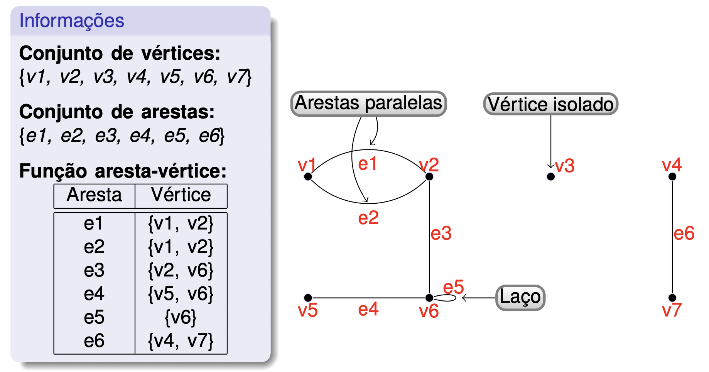
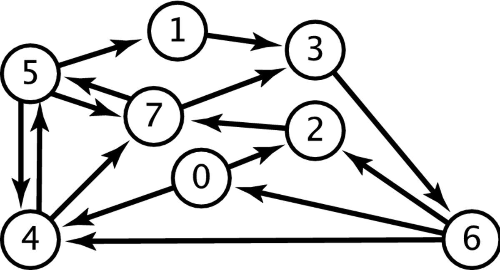
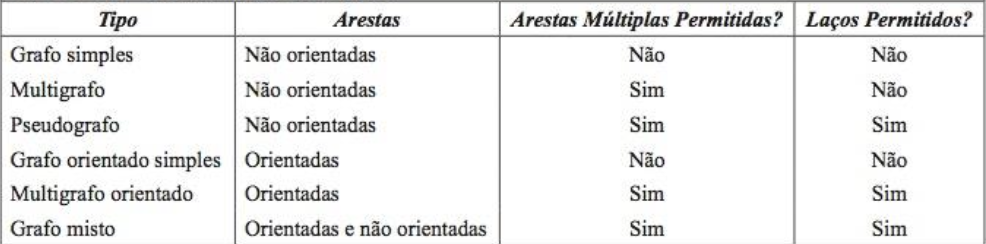
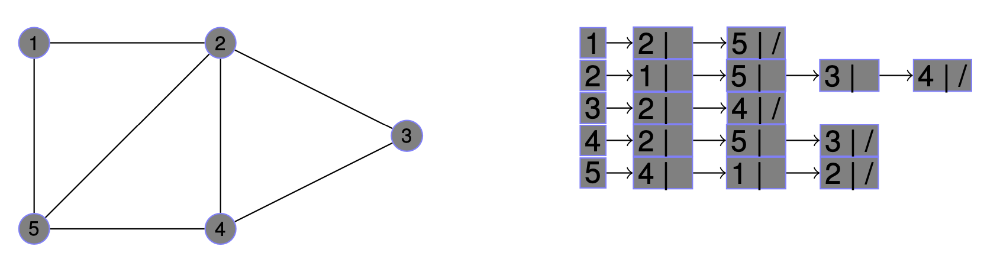
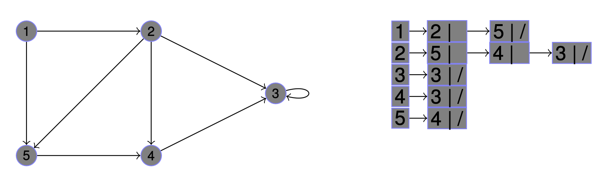
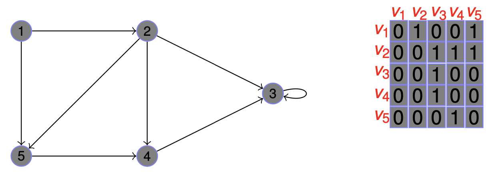

<div align="justify">

<div align="center">

# Grafos: Algoritmo de Floyd-Warshall

#### Trabalho Prático da Disciplina de Algoritmo e Estrutura de Dados II

#### Gabriel Oliveira Alves

   

</div>

### Resumo
Este repositório tem o intuito de apresentar de forma resumida a teória dos grafos e implementar o algoritmo de Floyd-Warshall em um problema prático. A documentação refererente a este problema esta presente no arquivo [Documentation.md](Documentation.md).

## 1 - O que é um grafo?

Grafos, são estruturas discretas que consistem em vértices e aresta que ligam estes vértices. Dentro da teória de grafos, temos os ***Grafos Não-Orientados*** e os ***Grafos Orientados***(Digrafos ou grafos dirigidos), alguns possuem características únicas e são chamados de Grafos Especiais. Matemáticamente, um grafo pode ser representado por $G = (V,E)$, sendo $V$ um conjunto não vazio de vértices e $E$ o conjunto de arestas. No caso dos grafos orientados, cada aresta orientada está associada a um par ordenado de vértices. É dito que a aresta orientada associada ao par de vértices $ {(u,v)} $ começa em $u$ e termina em $v$.

- Dizemos que há um laço em um vértice quando, existe uma aresta que se liga a este mesmo vértice.
- Arestas paralelas são quando duas arestes ligam o mesmo par de vértices de forma igual.

<div align="center">

<br>
Figura 1 - Representação de Grafo Não-Orientado.

<br>
Figura 2 - Representação de Grafo Orientado com múltiplas arestas.

<br>
Figura 3 - Tabela de terminologia de alguns grafos.

</div>

## 2 - Implementação de Grafos

Em literatura, temos 3 estruturas que podem representar um grafo. ***Lista de Adjacências***, ***Matriz de Adjacências*** e ***Matriz de Incidências***, apenas as duas primeiras estruturas serão abordadas. Estas estruturas são utilizadas para representar grafos nas implementações por meio de código em linguagem de programação.

> Quando um grafo apresenta uma quantidade substancialmente  grande de conexões e este grafo tem o seu conjunto de arestas $(|E|)$ proximo do conjunto de vértices ao quadrado $(|V^2|)$, dizemos que é um **Grafo Denso**.

> Quando o conjunto de arestas $(|E|)$ apresenta uma quantidade substancialmente menor que o conjunto de vértices ao quadrado $(|V^2|)$, dizemos que este é uma **Grafo Esparso**.

### 2.1 - Lista de Adjacências

A representação de lista de adjacências de um grafo $G = (V , E )$ consiste em um arranjo (vetor ou lista dinâmica) de Adj. de $|V|$ listas, uma para cada vértice em $V$. Logo, para cada $u ∈ V$, a lista de adjacência Adj[$u$] contém todos os vértices $v$ que definem uma aresta $(u, v ) ∈ E$.

<div align="center">

<br> Figura 4 - Lista de Adjacências em grafo não-orientado.

<br> Figura 4 - Lista de Adjacências em grafo orientado.
</div>

De acordo com a literatura de referência, o custo do gasto de memória é dado por $\mathcal{O}(V+E)$. É indicada para ***grafos esparsos*** e não representa arestas múltiplas.

### 2.2 - Matriz de Adjacências

A representação da matriz de adjacências $A_G$ de $G = (V,E)$ é a matriz zero-um (binária) (n,n), com 1 como seu elemento $(i,j)$ quando $v_i$ e $v_j$ forem adjacêntes e 0 como seu elemento $(i,j)$ quando eles não forem. Em outras palavras, se sua matriz de adjacência é , então:


<div align="right">

$$
a_{ij} = \begin{cases}
1 & \text{ se } {(v_i,v_j) \in G}\\ 
0 & \text{ se } {(v_i,v_j) \notin G}
\end{cases}\\
$$

Equação 1
</div>


<div align="center">

<br>
Figura 5 - Matriz de adjacências em grafo não-orientado.

<br>
Figura 6 - Matriz de adjacências em grafo orientado.

</div>

A matriz de adjacências facilita a pesquisa de arestas e por isso é uma ótima opção para ***grafos densos***. Consegue representar arestas múltiplas, mas o seu custo de gasto de memória é na ordem de $\mathcal{O}(V^2)$.

> Ambas as estruturas apresentadas, podem representar **Grafos Ponderados**.

> Toda matriz de adjacências sem laços, tem os elementos de sua *diagonal principal* iguais a zero.


**Grafos Ponderados** são grafos em que as arestas que conectam os vértices, possuem pesos(valores).

## 3 - Algoritmo de Floyd-Warshall

O algoritmo **Floyd-Warshall** é responsável por encontrar o caminho mínimo ("caminho mais curto") entre todos os pares de vértices de um grafo. Este grafo deve ser **orientado** e **ponderado**.

- Para explicar como o **Floyd-Warshall** funciona, antes deve-se ter o conhecimento de que as arestas podem ter valor (peso) negativo, entretanto,não poderá haver nenhum ciclo negativo - Caminho circular com todas as arestas com pesos negativos.

Conforme as literaturas de referência, o algoritmo de **Floyd-Warshall**, recebe como entrada uma matriz de adjacências $A_G$ que representa um grafo $G = (V,E)$ de acordo com a definição dada no primeiro parágrafo deste tópico. Supondo que a matriz de adjacências da entrada, esteja preenchida corretamente no formato dado pela equação:

<div align="right">

$$
a_{ij} = \begin{cases}
p & \text{ se } {(v_i,v_j) \in G}\\ 
\infty & \text{ se } {(v_i,v_j) \notin G}
\end{cases}\text{;\space Sendo p, o peso da aresta.}
$$
Equação 2
</div>

Conseguiremos aplicar o algoritmo recursivo, exemplo de programação dinâmica, afim de encontrar o menor caminho entre um par de vértices. Isso será feito com a ajuda de um vértice intermediário $k$ pertecente à um subconjunto de vértices $K \in |V|$.
 - Para qualquer par de vértices $(i,j)$ em $V$, considere todos os caminhos de $i$ a $j$ cujos vértices intermédios pertencem ao subconjunto $K$, e $p$ como o caminho mais curto de todos eles.
 - O Algoritmo se baseia em explorar a relação entre o caminho $p$ e todos os caminhos mais curtos de $i$ a $j$ com todos os vértices intermédios de $K$(1,2,3...$k-1$).
 - A verificação dessa relação no algoritmo dependerá de $k$ ser ou não um vértice intermédio do caminho de $p$.

O pseudocódigo abaixo utiliza-se duas matrizes de adjacências: A matriz de distâncias $\text{m\_dist}$ preenchida conforme a Equação 1 e a matriz de caminhos predecessores $\text{m\_pred}$ inicializada com valores nulos.  

```
// Sendo n o tamanho do conjunto de vértices do grafo G, temos:

FLOYD-WARSHALL(Matriz m_dist(n,n), matriz m_pred(n,n))
    PARA K de 1 à n:
        PARA i de 1 à n:
            PARA j de 1 à n:

                Se m_dist[i,j] > m_dist[i,k] + m_dist[k,j] ENTÃO:
                    
                    m_dist[i,j] = dist[i,k] + dist[k,j]
                    m_pred[i,j] = m_pred[k,j] // salva o índice do vértice que um caminho para m_dist[i,j]
                
                Fim-Se

            FIM-PARA
        FIM-PARA
    FIM-PARA
FIM-FUNÇÃO
```


## 4 - Referências

## Compilação e Execução

Para compiplar e executar o algoritmo, este repositório deve ser ***clonado***. Depois, acessar a pasta `code` de caminho **`Graph-Floyd-Warshall/code`** e Executar os comandos abaixo conforme suas funções.

| Comando                |  Função                                                                                           |                     
| -----------------------| ------------------------------------------------------------------------------------------------- |
|  `make clean`          | Apaga a última compilação realizada contida na pasta build                                        |
|  `make`                | Executa a compilação do programa utilizando o gcc, e o resultado vai para a pasta build           |
|  `make run`            | Executa o programa da pasta build após a realização da compilação                                 |


</div>